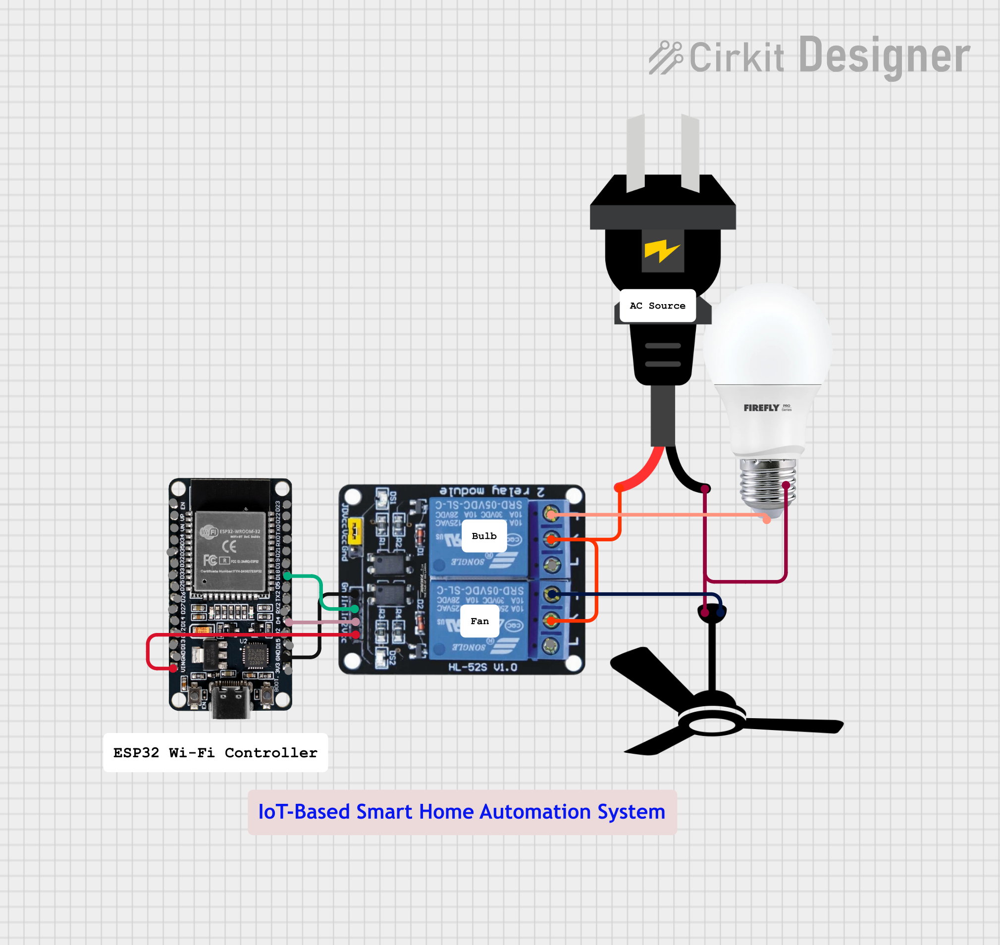

# IoT-Smart-Home-Automation-Using-ESP32
## Overview
This project demonstrates a smart home automation system using ESP32 and relay modules. Users can remotely control home appliances through a mobile application over Wi-Fi.

## Objectives
- Control appliances remotely
- Monitor device status
- Enable IoT-based home automation

## Circuit Diagram

## Components Used

- ESP32 Development Board
- 2-Channel Relay Module
- AC Bulb
- AC Fan
- Wi-Fi Network
- Jumper Wires

## Working Principle
The ESP32 connects to a Wi-Fi network and receives commands from the mobile application. Based on the received command, the relay switches connected appliances ON or OFF.

## Working

1. ESP32 connects to a Wi-Fi network.
2. ESP32 hosts a local web server.
3. Users access the ESP32 IP address through a web browser.
4. ON/OFF commands are sent from the browser.
5. Relay module switches the connected appliances.
## Features
- Remote appliance control
- Real-time operation
- Low-cost implementation
- Scalable design

## Applications
- Smart homes
- Energy management
- Remote monitoring

## Future Scope
- Voice control using Google Assistant
- Power consumption monitoring
- AI-based automation

## Author
**Anil Kumar Senapati**  
B.Tech Electronics and Telecommunication Engineering (ETC)
